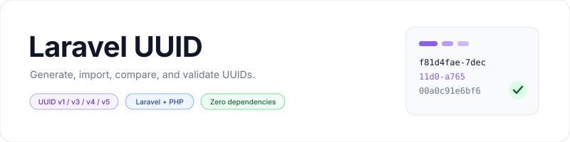

<p align="center">
    <picture>
        <source media="(prefers-color-scheme: dark)" srcset="art/banner-dark.svg">
        <source media="(prefers-color-scheme: light)" srcset="art/banner-light.svg">
        
    </picture>
</p>

<p align="center">Generate, import, compare, and validate version 1, 3, 4, and 5 UUIDs in Laravel or plain PHP.</p>

<p align="center">
    <a href="https://packagist.org/packages/jeremykenedy/uuid"></a>
    <a href="https://packagist.org/packages/jeremykenedy/uuid"></a>
    <a href="https://github.com/jeremykenedy/laravel-uuid/actions/workflows/tests.yml"></a>
    <a href="https://github.styleci.io/repos/97753869"></a>
    <a href="LICENSE"></a>
</p>

## Table of Contents

- [Framework Support](#framework-support)
- [Requirements](#requirements)
- [Installation](#installation)
- [Quick Start](#quick-start)
- [Features](#features)
- [Configuration](#configuration)
- [Generating UUIDs](#generating-uuids)
- [Importing and Comparing UUIDs](#importing-and-comparing-uuids)
- [UUID Properties](#uuid-properties)
- [Validation](#validation)
- [Updating](#updating)
- [Testing](#testing)
- [Changelog](#changelog)
- [Credits](#credits)
- [License](#license)

## Framework Support

The UUID class works without Laravel. Laravel integration registers the `Uuid` alias and a `uuid` validation extension.

| Environment | PHP versions covered by CI | Registration |
| --- | --- | --- |
| Plain PHP | 7.0 through 7.4, 8.0 through 8.5 | Composer autoload |
| Laravel 5.3 and 5.4 | 7.0 | Manual provider and alias |
| Laravel 5.5 | 7.0 | Package discovery |
| Laravel 5.6 and 5.7 | 7.2 | Package discovery |
| Laravel 5.8, 6, and 7 | 7.3 | Package discovery |
| Laravel 8 | 7.4 | Package discovery |
| Laravel 9 and 10 | 8.1 | Package discovery |
| Laravel 11 | 8.2 | Package discovery |
| Laravel 12 | 8.2 and 8.5 | Package discovery |
| Laravel 13 | 8.3 and 8.5 | Package discovery |

Older versions remain in the compatibility matrix for existing applications. These checks do not extend PHP or Laravel's upstream support periods.

## Requirements

- PHP 7.0 or later.
- Composer.
- Laravel is optional. When using Laravel, follow its PHP requirements as well.

Random UUIDs use PHP's built-in `random_bytes()` function. There is no fallback to `mt_rand()` and no additional runtime package dependency.

## Installation

```bash
composer require jeremykenedy/uuid
```

Laravel 5.5 and later discover the service provider and alias automatically. No install command, published configuration, migration, or asset build is needed. Running Composer again uses the existing installation.

For Laravel 5.3 and 5.4, or applications with package discovery disabled, add these entries to the existing arrays in `config/app.php`:

```php
'providers' => [
    jeremykenedy\Uuid\UuidServiceProvider::class,
],

'aliases' => [
    'Uuid' => jeremykenedy\Uuid\Uuid::class,
],
```

In plain PHP, load `vendor/autoload.php` and import `jeremykenedy\Uuid\Uuid` directly.

## Quick Start

```php
use jeremykenedy\Uuid\Uuid;

$uuid = Uuid::generate();

(string) $uuid;  // Canonical UUID string.
$uuid->version;  // 1, the existing default.
$uuid->bytes;    // 16 bytes for binary storage.

$random = Uuid::generate(4);
Uuid::validate($random->string);
```

The package runs on the server and can be used with any frontend. It does not provide views or select a CSS framework.

## Features

- Version 1 UUIDs with a supplied node or a random multicast node.
- Deterministic version 3 and 5 UUIDs from a name and namespace.
- Version 4 UUIDs using cryptographically secure random bytes.
- Import from canonical strings, hexadecimal strings, URNs, binary strings, or UUID objects.
- Access to the UUID's bytes, version, variant, node, and timestamp.
- Laravel package discovery and validation integration.
- PHP 7.0 compatibility with coverage through PHP 8.5.

## Configuration

There is no configuration file. Choose the UUID version when calling `generate()`:

| Argument | Default | Purpose |
| --- | --- | --- |
| `$ver` | `1` | UUID version: `1`, `3`, `4`, or `5` |
| `$node` | `null` | Version 1 node address, or the name for versions 3 and 5 |
| `$ns` | `null` | Namespace UUID required for versions 3 and 5 |

## Generating UUIDs

```php
use jeremykenedy\Uuid\Uuid;

$timeBased = Uuid::generate(1);
$withNode = Uuid::generate(1, '00:11:22:33:44:55');
$md5 = Uuid::generate(3, 'example.com', Uuid::NS_DNS);
$random = Uuid::generate(4);
$sha1 = Uuid::generate(5, 'https://example.com', Uuid::NS_URL);
```

Versions 3 and 5 require a nonempty name and a namespace. The same name, namespace, and version produce the same UUID. The predefined namespaces are `NS_DNS`, `NS_URL`, `NS_OID`, and `NS_X500`.

Version 1 uses the current time. When the node is omitted or invalid, the package generates a random node and sets its multicast bit. Versions 2, 6, 7, and 8 are not supported by the generator.

## Importing and Comparing UUIDs

```php
$uuid = Uuid::import('d3d29d70-1d25-11e3-8591-034165a3a613');
$copy = Uuid::import($uuid->bytes);

Uuid::compare($uuid, $copy); // true
Uuid::compare($uuid->urn, $uuid->string); // true
```

Import also accepts uppercase text, braces, hexadecimal strings without separators, and stringable objects. Imported strings are normalized to lowercase.

Legacy input handling is preserved: invalid imports have `null` bytes and the string `----`, and comparing two invalid inputs returns `true`. Validate untrusted values before importing or comparing them.

## UUID Properties

| Property | Value |
| --- | --- |
| `string` | Canonical UUID string |
| `bytes` | 16-byte binary string |
| `hex` | 32 hexadecimal characters without separators |
| `urn` | UUID string prefixed with `urn:uuid:` |
| `version` | Version number encoded in the UUID |
| `variant` | `0` for NCS, `1` for RFC 4122, `2` for Microsoft, `3` for reserved |
| `node` | Version 1 node as 12 hexadecimal characters; otherwise `null` |
| `time` | Version 1 Unix timestamp in seconds, including the fractional part; otherwise `null` |

Casting a UUID to a string returns `string`. The existing public `bytes` and `string` properties remain writable, and serialization keeps the same property names. Subclasses can keep their existing storage visibility, and caller-added properties remain supported.

## Validation

```php
Uuid::validate('d3d29d70-1d25-11e3-8591-034165a3a613'); // true
Uuid::validate('invalid'); // false
Uuid::validate(null); // false
```

`Uuid::validate()` accepts the same representations as `import()`. It checks whether the input can be normalized into a UUID, not whether its version and variant are supported by the generator. This preserves existing behavior, including nil UUIDs and any 16-byte binary string.

For Laravel request validation:

```php
$request->validate([
    'id' => ['required', 'uuid'],
]);
```

The provider registers the package's `uuid` extension. Laravel versions with a built-in `uuid` rule use their own rule first, as before. Use `Uuid::validate()` directly when you need this package's permissive import behavior.

## Updating

```bash
composer update jeremykenedy/uuid
```

The package name, namespace, provider, alias, version 1 default, and runtime PHP minimum are unchanged. Updates do not publish files or modify application configuration. There are no package-specific Artisan commands.

## Testing

```bash
composer install
composer test
```

Composer selects a compatible PHPUnit version for the installed PHP version. Tests cover published name-based UUID vectors, generation, import formats, validation, comparison, timestamps, public properties, serialization, subclasses, and PHP warnings and deprecations.

To run the Laravel integration tests, install the Laravel version you want to check as a development dependency in this checkout:

```bash
composer require --dev 'laravel/framework:^13.0'
vendor/bin/phpunit tests/Integration
```

Choose a framework release compatible with your PHP version. This command changes the local development dependencies; do not commit that change. Integration tests cover provider registration, Laravel validation, alias loading, and package discovery. Discovery checks are skipped on Laravel 5.3 and 5.4, which predate that feature.

Run the formatter with the repository's `pint.json` configuration using a separately installed Laravel Pint on a supported PHP version:

```bash
pint --test
```

GitHub Actions runs the PHP and Laravel matrix, PHP syntax checks, Pint, Composer validation, and a dependency audit. The formatter is installed separately so it does not raise the package's PHP minimum.

## Changelog

See [CHANGELOG.md](CHANGELOG.md) for changes and compatibility notes.

## Credits

This package was originally forked from [webpatser/laravel-uuid](https://github.com/webpatser/laravel-uuid).

## License

This package is open-sourced software licensed under the [MIT license](LICENSE).
